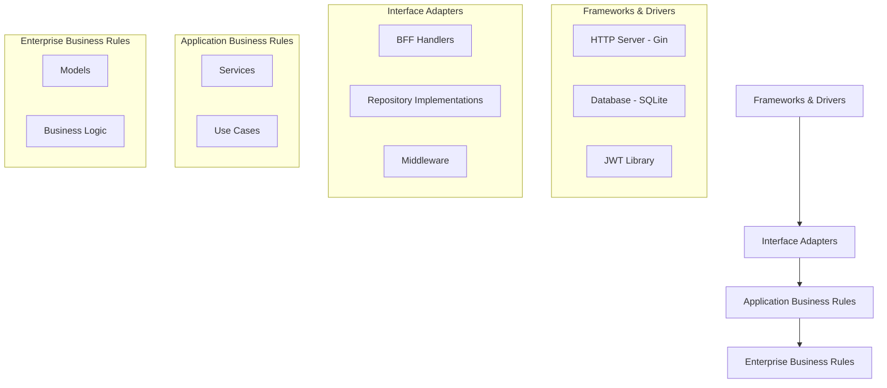
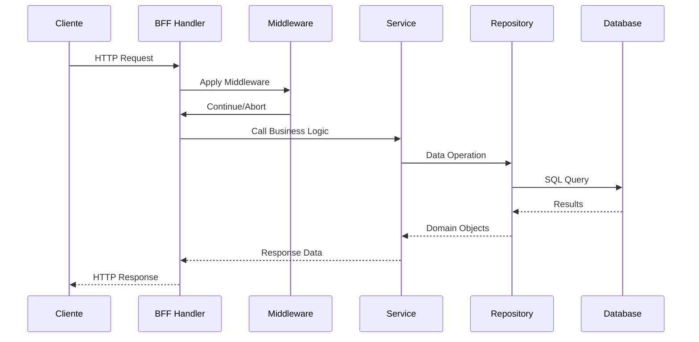
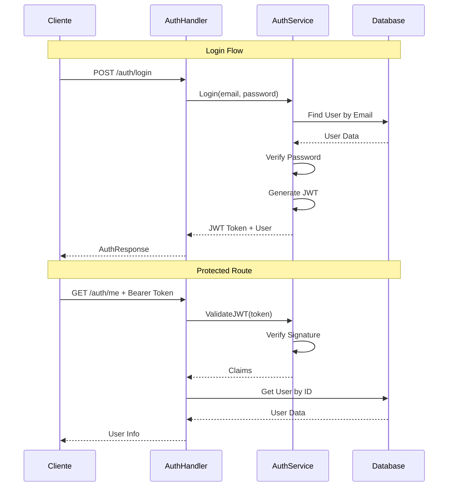

# Guia de Arquitetura - RPG Backend

## 🏗️ Visão Geral da Arquitetura

O RPG Backend foi desenvolvido seguindo os princípios da **Clean Architecture**, garantindo separação clara de responsabilidades, testabilidade e manutenibilidade do código.

## 📂 Estrutura de Diretórios

```
rpg-backend/
├── cmd/
│   ├── api/                 # Ponto de entrada da aplicação
│   │   └── main.go          # Configuração do servidor HTTP
│   └── migrate/             # Utilitário de migrações
│       └── main.go          # CLI para executar migrações
├── internal/
│   ├── bff/                 # Backend For Frontend Layer
│   │   ├── handler.go       # Configuração central de rotas
│   │   ├── auth.go          # Handlers de autenticação
│   │   ├── user.go          # Handlers de usuários
│   │   ├── sheet_template.go # Handlers de templates
│   │   └── health.go        # Healthcheck handler
│   └── app/
│       ├── services/        # Camada de Lógica de Negócio
│       │   ├── auth.go      # Serviços de autenticação
│       │   └── sheet_template.go # Serviços de templates
│       ├── repositories/    # Camada de Acesso aos Dados
│       │   └── sheet_template.go # Repositório de templates
│       ├── models/          # Estruturas de Dados
│       │   ├── user.go      # Modelos de usuário
│       │   └── sheet_template.go # Modelos de templates
│       └── middleware/      # Middlewares HTTP
│           └── auth.go      # Middleware de autenticação JWT
├── pkg/
│   ├── db/                  # Infraestrutura de Banco de Dados
│   │   ├── connection.go    # Gerenciamento de conexões
│   │   └── migrations.go    # Sistema de migrações
│   └── config/              # Configurações da Aplicação
│       └── config.go        # Carregamento de configurações
├── migrations/              # Scripts de Migração SQL
├── docs/                    # Documentação
└── data/                    # Dados locais (SQLite)
```

## 🎯 Princípios da Clean Architecture

### 1. **Camadas e Dependências**



### 2. **Fluxo de Dependências**

- **Externas para Internas**: As dependências sempre apontam para dentro
- **Abstração**: Camadas externas dependem de abstrações, não de implementações
- **Inversão de Dependência**: Interfaces definem contratos

## 📋 Responsabilidades por Camada

### **1. Camada BFF (Backend For Frontend)**
**Localização**: `internal/bff/`

**Responsabilidades**:
- Receber requisições HTTP
- Validar dados de entrada
- Chamar serviços apropriados
- Formatar respostas HTTP
- Aplicar middlewares

**Arquivos**:
```go
// handler.go - Configuração central
type Handler struct {
    authHandler          *AuthHandler
    userHandler          *UserHandler
    sheetTemplateHandler *SheetTemplateHandler
}

// auth.go - Endpoints de autenticação
func (h *AuthHandler) Signup(c *gin.Context)
func (h *AuthHandler) Login(c *gin.Context)
func (h *AuthHandler) Me(c *gin.Context)

// user.go - Endpoints de usuários
func (h *UserHandler) ListUsers(c *gin.Context)
func (h *UserHandler) ListUsersProtected(c *gin.Context)
```

### **2. Camada de Serviços (Business Logic)**
**Localização**: `internal/app/services/`

**Responsabilidades**:
- Implementar regras de negócio
- Validar dados de acordo com regras de domínio
- Coordenar operações entre repositórios
- Transformar dados entre camadas

**Arquivos**:
```go
// auth.go - Lógica de autenticação
func (s *AuthService) Signup(req models.UserSignupRequest) (*models.User, error)
func (s *AuthService) Login(req models.UserLoginRequest) (string, *models.User, error)
func (s *AuthService) ValidateJWT(tokenString string) (jwt.MapClaims, error)

// sheet_template.go - Lógica de templates
func (s *SheetTemplateService) Create(req models.CreateSheetTemplateRequest) (*models.SheetTemplateResponse, error)
func (s *SheetTemplateService) ValidateCreateRequest(req models.CreateSheetTemplateRequest) []models.SheetTemplateValidationError
```

### **3. Camada de Repositório (Data Access)**
**Localização**: `internal/app/repositories/`

**Responsabilidades**:
- Executar operações CRUD no banco
- Mapear dados entre SQL e structs Go
- Gerenciar transações
- Implementar queries específicas

**Arquivos**:
```go
// sheet_template.go - Acesso a dados de templates
func (r *SheetTemplateRepository) Create(req models.CreateSheetTemplateRequest) (*models.SheetTemplate, error)
func (r *SheetTemplateRepository) GetByID(id int) (*models.SheetTemplate, error)
func (r *SheetTemplateRepository) GetAll(offset, limit int) ([]*models.SheetTemplate, error)
```

### **4. Camada de Modelos (Domain)**
**Localização**: `internal/app/models/`

**Responsabilidades**:
- Definir estruturas de dados do domínio
- Especificar regras de validação
- Implementar métodos de transformação
- Compor tipos através de herança/composição

**Arquivos**:
```go
// user.go - Modelos de usuário
type User struct {
    ID           int       `json:"id" db:"id"`
    Email        string    `json:"email" db:"email"`
    PasswordHash string    `json:"-" db:"password_hash"`
    CreatedAt    time.Time `json:"created_at" db:"created_at"`
    UpdatedAt    time.Time `json:"updated_at" db:"updated_at"`
}

// sheet_template.go - Modelos de templates com composição
type SheetTemplate struct {
    DatabaseFields
    BaseTemplateFields
    DefinitionFieldDB
}
```

### **5. Middleware**
**Localização**: `internal/app/middleware/`

**Responsabilidades**:
- Interceptar requisições HTTP
- Implementar funcionalidades transversais
- Autenticação e autorização
- Logging e métricas

**Arquivos**:
```go
// auth.go - Middleware de autenticação
func AuthMiddleware(authService *services.AuthService) gin.HandlerFunc
func OptionalAuthMiddleware(authService *services.AuthService) gin.HandlerFunc
func GetUserFromContext(c *gin.Context) (userID int, email string, exists bool)
```

### **6. Infraestrutura**
**Localização**: `pkg/`

**Responsabilidades**:
- Gerenciar conexões externas
- Configurar recursos de infraestrutura
- Implementar utilitários comuns
- Executar migrações

**Arquivos**:
```go
// pkg/db/connection.go - Conexão com banco
func NewDB(databaseURL string) (*DB, error)
func (db *DB) Health() error

// pkg/config/config.go - Configurações
func Load() (*Config, error)
```

## 🔄 Fluxos de Execução

### **1. Fluxo de Requisição HTTP**



### **2. Fluxo de Autenticação**



## 🛡️ Padrões de Segurança

### **1. Autenticação JWT**
- Tokens assinados com chave secreta
- Expiração configurável (24h padrão)
- Claims customizados (user_id, email)

### **2. Middleware de Proteção**
```go
// Obrigatório - bloqueia sem token
middleware.AuthMiddleware(authService)

// Opcional - permite com/sem token
middleware.OptionalAuthMiddleware(authService)
```

### **3. Validação de Dados**
- Tags de validação nos modelos
- Validação na camada de serviços
- Sanitização de entrada

## 📊 Padrões de Resposta

### **1. Sucesso**
```json
{
  "data": {...},
  "status": "success"
}
```

### **2. Erro de Validação**
```json
{
  "error": "Dados inválidos",
  "fields": [
    {
      "field": "email",
      "message": "Email deve ser válido",
      "value": "email-inválido"
    }
  ],
  "timestamp": "2025-07-11T09:26:29Z"
}
```

### **3. Erro de Autorização**
```json
{
  "error": "Token de autorização requerido",
  "timestamp": "2025-07-11T09:26:29Z"
}
```

## 🔧 Configuração e Extensibilidade

### **1. Adicionando Nova Funcionalidade**

1. **Criar Modelo** em `internal/app/models/`
2. **Criar Repository** em `internal/app/repositories/`
3. **Criar Service** em `internal/app/services/`
4. **Criar Handler** em `internal/bff/`
5. **Registrar Rotas** em `handler.go`

### **2. Exemplo Prático: Campanha**

```go
// 1. Model
type Campaign struct {
    ID          int    `json:"id" db:"id"`
    Name        string `json:"name" db:"name"`
    Description string `json:"description" db:"description"`
    // ...
}

// 2. Repository
type CampaignRepository struct {
    db *db.DB
}

// 3. Service
type CampaignService struct {
    repo *repositories.CampaignRepository
}

// 4. Handler
type CampaignHandler struct {
    service *services.CampaignService
}

// 5. Routes
func (h *Handler) SetupRoutes(router *gin.RouterGroup) {
    h.campaignHandler.SetupCampaignRoutes(router)
}
```

## 📋 Boas Práticas

### **1. Naming Conventions**
- **Handlers**: `*Handler` (ex: `UserHandler`)
- **Services**: `*Service` (ex: `AuthService`)
- **Repositories**: `*Repository` (ex: `TemplateRepository`)
- **Models**: Nome do domínio (ex: `User`, `Campaign`)

### **2. Error Handling**
- Erros específicos por domínio
- Wrapping de erros com contexto
- Logging estruturado

### **3. Testing Strategy**
- Unit tests para services
- Integration tests para repositories
- End-to-end tests para handlers

### **4. Performance**
- Connection pooling no banco
- Lazy loading quando apropriado
- Paginação em listagens
- Índices adequados no banco

---

Esta arquitetura garante escalabilidade, manutenibilidade e testabilidade do código, seguindo as melhores práticas da comunidade Go! 🚀
